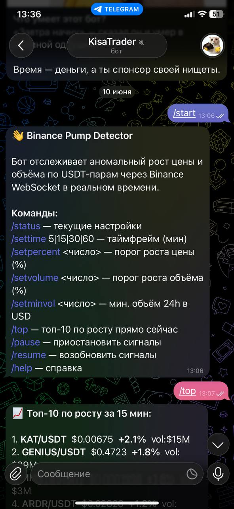
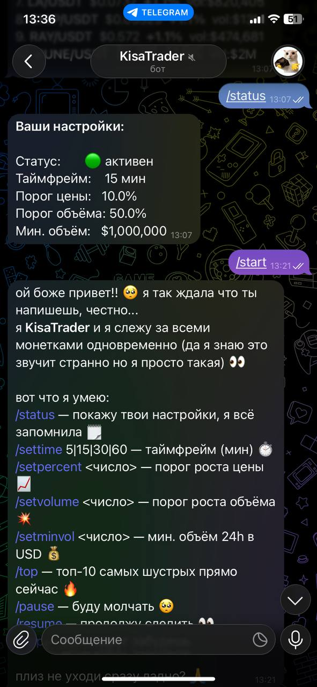
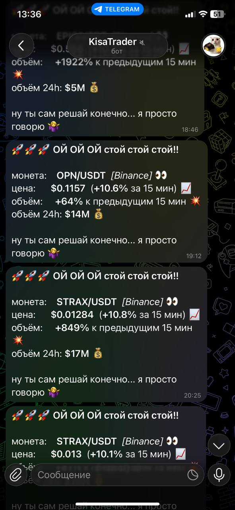
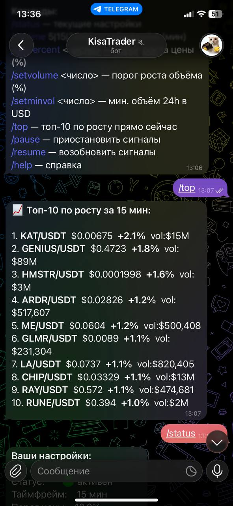

# Crypto Pump Monitor


A Telegram bot that watches Binance and Bybit market data in real time and notifies users when a trading pair moves beyond their selected thresholds.


I built this project to practice asynchronous Python, WebSocket streams and per-user notification settings. It is a monitoring tool, not an automated trading system and not financial advice.


## Bot interface


The screenshots below show the Telegram workflow from configuration to real-time market alerts.


<table>
  <tr>
    <td align="center" width="50%">
      <br>
      <strong>Command menu</strong><br>
      <sub>Configure the timeframe, price and volume thresholds, minimum 24-hour volume, or pause notifications.</sub>
    </td>
    <td align="center" width="50%">
      <br>
      <strong>Per-user settings</strong><br>
      <sub>The <code>/status</code> command shows whether monitoring is active and lists the current alert thresholds.</sub>
    </td>
  </tr>
  <tr>
    <td align="center" width="50%">
      <br>
      <strong>Real-time alerts</strong><br>
      <sub>Each signal includes the trading pair, exchange, 15-minute price move, relative volume change and 24-hour volume.</sub>
    </td>
    <td align="center" width="50%">
      <br>
      <strong>Top market movers</strong><br>
      <sub>The <code>/top</code> command returns the ten fastest-growing pairs for the selected timeframe.</sub>
    </td>
  </tr>
</table>


## What it does


- receives live market updates from Binance and Bybit;
- detects rapid price and volume changes;
- lets each Telegram user configure alert thresholds;
- sends formatted signals with exchange and pair information;
- stores user settings and bot state in SQLite;
- supports Docker-based deployment.


## Tech stack


- Python
- aiogram 3
- asyncio and WebSockets
- aiohttp
- aiosqlite
- Docker Compose


## Run locally


```bash
git clone https://github.com/Hackcatimka/crypto-market-alert-bot.git
cd crypto-market-alert-bot
python -m venv .venv
```


Activate the virtual environment, install dependencies and create the local configuration:


```bash
pip install -r requirements.txt
cp .env.example .env
```


Add a Telegram bot token to `.env`, then run:


```bash
python bot.py
```


## Configuration


```env
BOT_TOKEN=your_telegram_bot_token
DB_PATH=bot.db
```


## Status


Portfolio project. Before using it for real market monitoring, add exchange reconnect tests, structured logging and stronger rate-limit handling.


## Disclaimer


This software is provided for educational and monitoring purposes only. It does not execute trades or provide investment recommendations.
